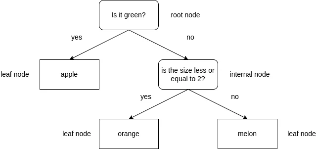
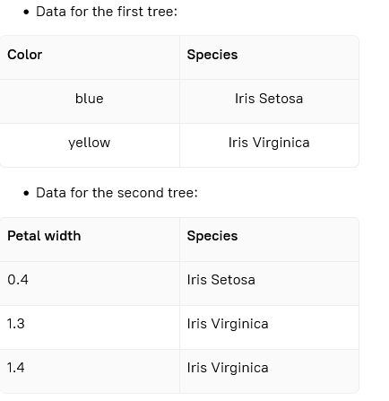
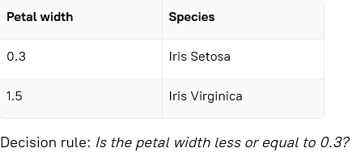
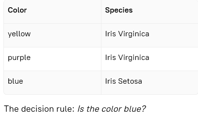
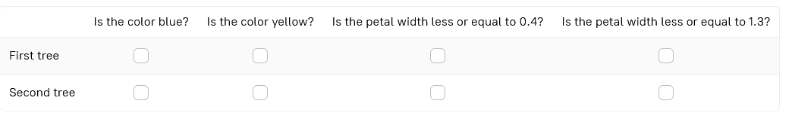

# Stage 1: Concept
## Theory
The **decision tree** is one of the most popular classification algorithms, as it is very easy to interpret. Any decision  
tree is a tree-like structure that produces a sequence of decision rules for various data features.

Let's consider binary decision trees. Each rule is a question with two options to split the data into two groups based  
on the answer — a yes or a no. For **categorical** features, such as color, a "sunny" or "rainy" weather, and so on, the  
question is "Is a feature ...?". For some features that can be measured, **continuous**, such as salary, weight, and length,  
the question is "Is the value of the feature less than or equal to X?"

The structure of a decision tree consists of several nodes and branches. A decision tree is drawn upside down, and the  
node at the top is called the **root node**. Each split generates two **branches**. Each split may also generate two types of  
**nodes**. If there are other possible splits to purify the data further, the node is an **internal node**. If there are no more  
possible splits or the node consists of one class, the node is called a **leaf node**.

## Description
In this stage, let's start building our decision tree model. But at first, let's find out how to choose a decision rule  
and understand how to construct it.

## Objectives
Try to build a decision tree intuitively with the provided data. In the following table, mark the decision rules that  
will create the best trees. If various decision rules are possible, mark both as answers.

- Data for the first tree:

- Data for the second tree:

## Examples
### Example 1:

Decision rule: _Is the petal width less or equal to 0.3?_

Example 2:

The decision rule: _Is the color blue?_

Choose one or more options for each row

