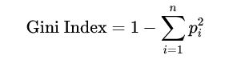
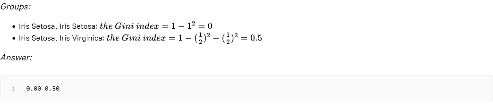

# Stage 2: Gini index
## Theory
The **Gini index** is applied to the group of samples; we can interpret it as the probability that a sample chosen at  
random from a dataset will be misclassified. You can say it measures the impurity of the data — the smaller the value  
of the Gini Index is, the purer the data. Recall the formula for the Gini Index:

where _p_i_ is the **probability**, represented by the proportion of the _i^th_ class in the data.

## Description
You know how to construct decision rules, but the question is how to pick the optimal one? This is when different  
measures of information disorder come into play. This stage aims at learning how to calculate one of them  
— the Gini index.

## Objectives
Find the Gini index for the groups:
- Iris Setosa, Iris Virginica, Iris Versicolor;
- Iris Setosa, Iris Setosa, Iris Virginica;
- Iris Virginica, Iris Virginica, Iris Setosa, Iris Versicolor.

## Example
### Example 1:

