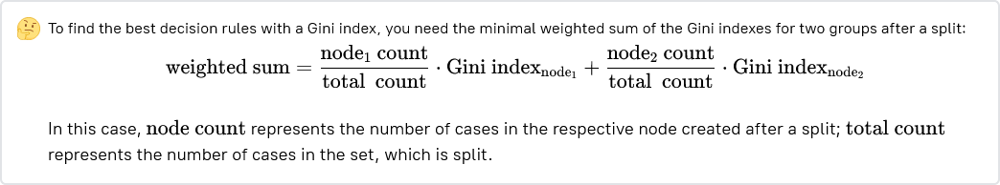
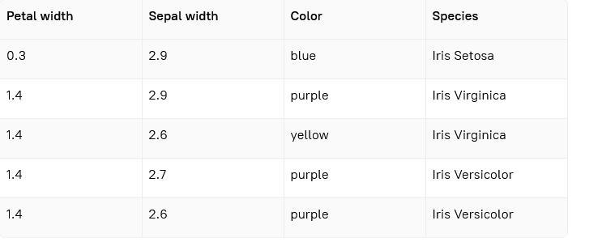
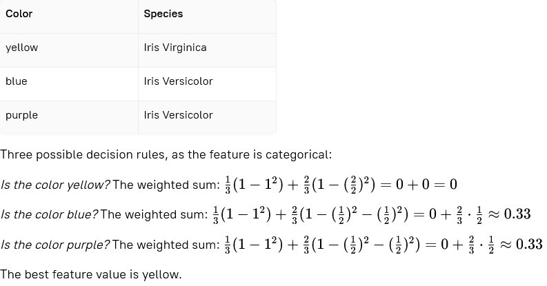
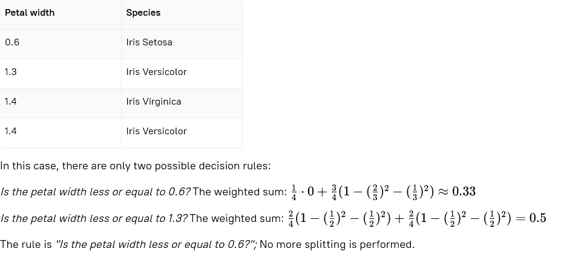
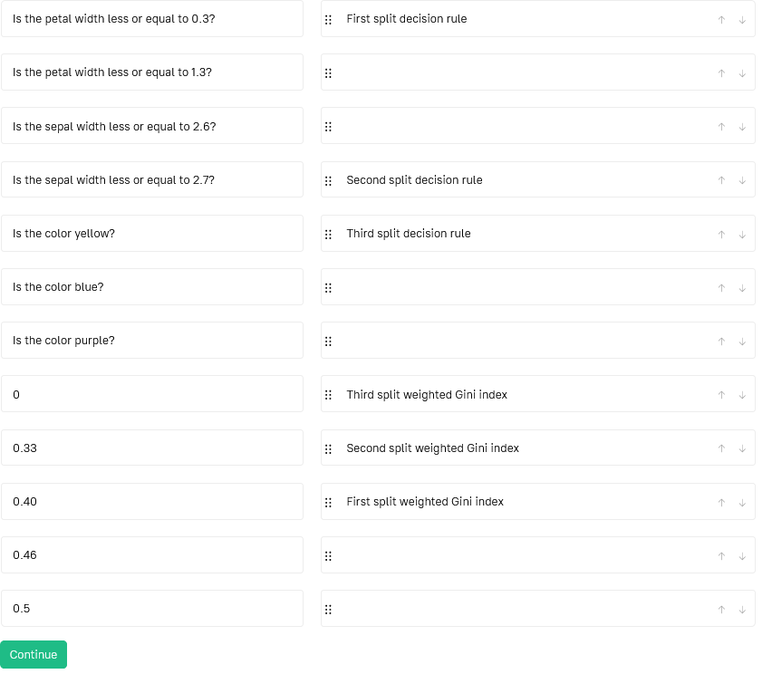

# Stage 3: Build a decision tree with the Gini index
## Description
Finally, it's time to build an actual decision tree! You already know how to create decision rules both for categorical  
and continuous features. Now, it's time to combine it with the Gini index to build an actual model.

The algorithm:
1. For each feature, generate all possible decision rules;
2. For each rule, find the metric value, in this case, the weighted Gini index;
3. Choose the rule according to the metric value;
4. Split the data;
5. For each group after a split, repeat the steps if it is not pure (contains several classes).

In the Gini index topic, you've already learned how to calculate the weighted Gini index for the whole categorial  
feature. But if we have continuous values, the approach described above should be used.  

## Objectives
* Build a decision tree using the Gini index on the following data:

* Use the first feature to create a split — if a rule for the petal width and a rule for the color are both suitable,  
  use the petal width to create a split.
* Use the first value in the feature column that gives the best split — if the rules for the petal width with values  
  of 0.30.3 and 1.41.4 are both suitable, use the value of 0.30.3, as it comes first in the column.
* After you build a decision tree, connect the values of the Gini index and decision rules to the corresponding splits.

## Examples
### Example 1:

Example 2:

# Correct Answer

### First Split Decision rule:
  Is the petal width less or equal to 0.3?
### First split weighted Gini index:
  0.4
### Second Split Decision rule:
  Is the sepal width less or equal to 2.7?
### Second split weighted Gini index:
  0.33
### Third Split Decision rule:
  Is the color yellow?
### Third split weighted Gini index:
  0

### Remained possibilities= None/Empty

