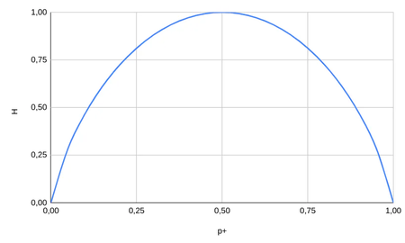
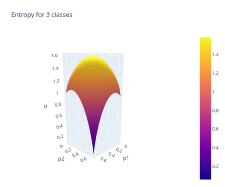
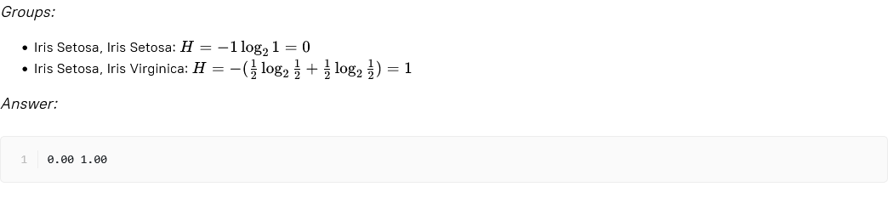

# Stage 4: Entropy
## Theory
In a nutshell, **entropy** is a measure of data randomness. The entropy formula goes as follows:

Where **p_i** is the frequentist probability. In the following figure, the entropy value distribution is plotted for a  
case of two possible classes: the `+` class and the `-` class. Less disorder in the data (the probability of the  
`+` class, denoted as **p+**, is either close to `0` or `1`) produces a smaller entropy. And vice versa — a higher  
disorder (the `+` probability is around `0.5`) outputs a higher entropy value.

Entropy for a case of two classes: the + class and the - class

It is harder to plot an entropy distribution for three classes. The following picture shows the entropy distribution
when the probability of the third class is fixed at 1/3:

Entropy for 3 classes  

## Description
Entropy is another measure of data impurity that may be used to find optimal data splits. But first, you need to  
calculate it.  

## Objectives
Find the entropy for the following groups:
- Iris Setosa, Iris Virginica, Iris Versicolor;
- Iris Setosa, Iris Setosa, Iris Virginica;
- Iris Virginica, Iris Virginica, Iris Setosa, Iris Versicolor.

## Example
### Example 1:

