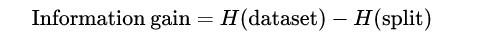
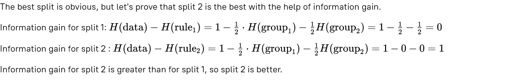
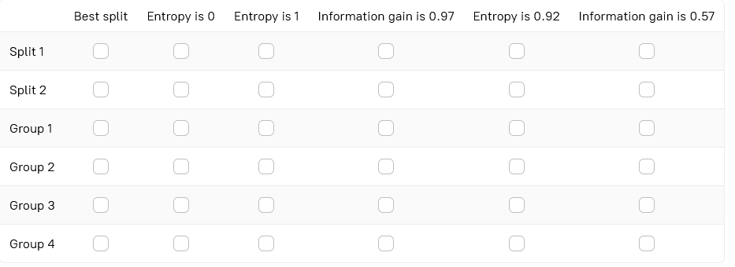
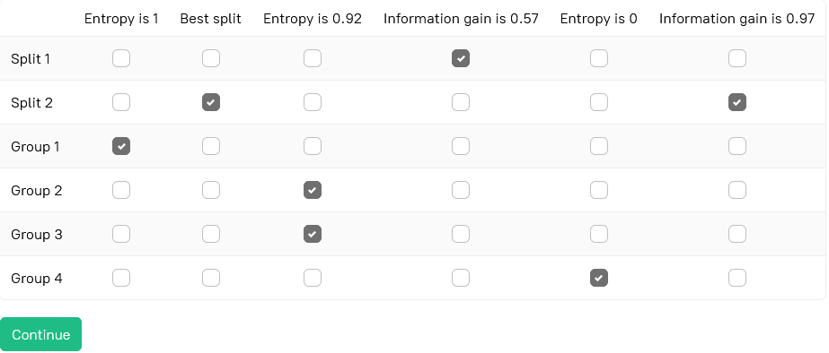

# Stage 5: Information gain
## Theory
**Information gain** is a term that speaks for itself — it shows how much information about the data we gain after a split  
based on the entropy. As the entropy shows how disordered the data is, the information gain shows how much of the  
disorder is excluded after a split.

Information gain can be represented as

Where **H(dataset)** is the data entropy before a split, and **H(split)** is the weighted sum of the resulting  
subset's entropies.  

## Description
Information gain denotes which rule and, subsequently, which data split is the best. In this stage, you should find  
information gain for several possible decision rules.  

## Objectives
Suppose you have a dataset: Iris Setosa, Iris Versicolor, Iris Versicolor, Iris Virginica, Iris Virginica.  
Consider two possible splits:

### Split 1 (rule1):
- Iris Setosa, Iris Virginica (Group 1);
- Iris Versicolor, Iris Versicolor, Iris Virginica (Group 2).

### Split 2 (rule2):
- Iris Versicolor, Iris Versicolor, Iris Setosa (Group 3);
- Iris Virginica, Iris Virginica(Group 4).

In the following table, specify the correct information gain for the splits and pick the best one. For each group,  
specify the entropy of the group.  

## Example
### Example 1:
Let's find the optimal split for the following data: Iris Setosa, Iris Setosa, Iris Versicolor, Iris Versicolor.  
The entropy of the data is **1**. Suppose two rules give us two different splits:

**Split 1 (rule1)**:
- Iris Setosa, Iris Versicolor (entropy for this group is **1**);
- Iris Setosa, Iris Versicolor (entropy for this group is **1**).

**Split 2 (rule2)**:
- Iris Setosa, Iris Setosa (entropy for this group is **0**);
- Iris Versicolor, Iris Versicolor (entropy for this group is **0**).

The best split is obvious, but let's prove that split 2 is the best with the help of information gain.

Choose one or more options for each row

