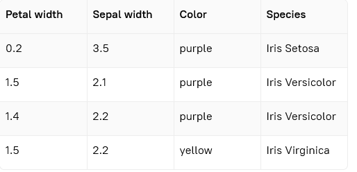
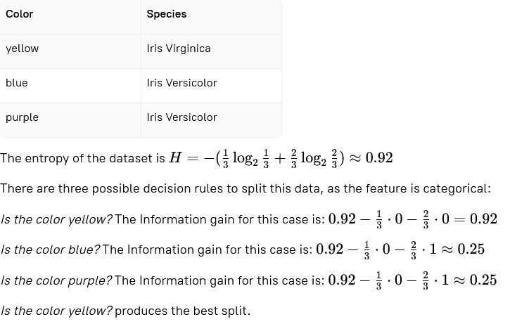
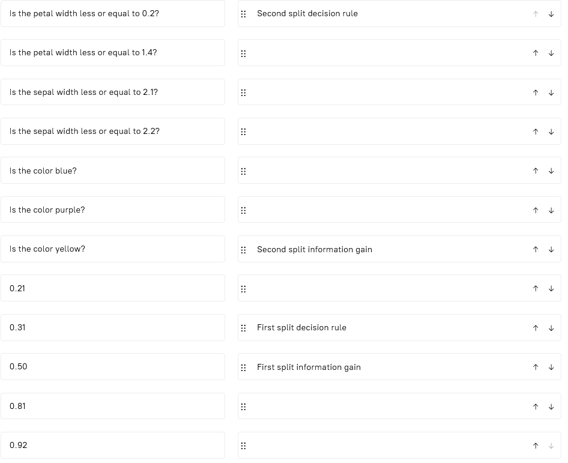
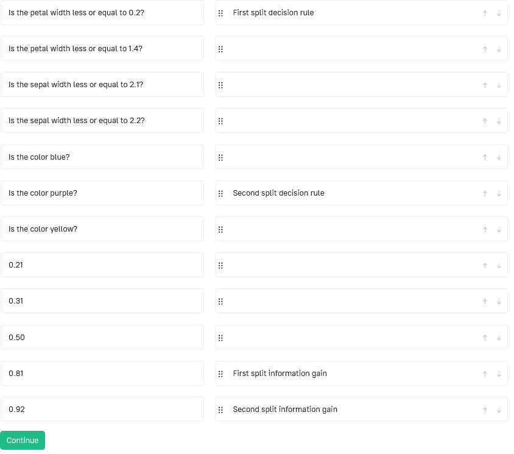

# Stage 6: Build a decision tree with information gain
## Description
In this stage, build a tree using the information gain.

## Objectives
In this stage, build a decision tree with Information gain for the following data:

- Use the first data feature to create a split — if the rule for the petal width and the rule for the color are both  
  suitable, use the petal width to create a split;
- Use the first value in the feature column that gives the best split — if the rules for the petal width with values  
  of **1.4** and **1.5** are both suitable, use **1.5**, as it comes first in the column.
- Having built a tree, connect the rules and the values of information gain to each split.

## Example
### Example 1:

### Match the items from left and right columns

