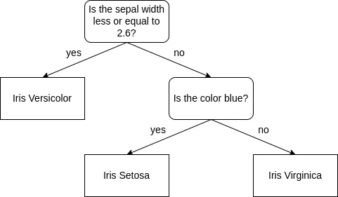
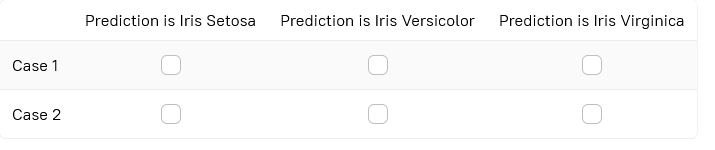
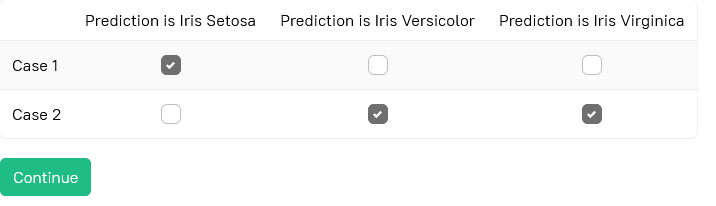

# Stage 7: Predict the cases
## Description
It's high time to make some predictions with the knowledge of the models you have built. The prediction means feeding  
each case of the unclassified data through the model.  

## Objectives
- Use the decision trees created in Stages 3 and 6 to predict classes for the following cases:

| Petal width | Sepal width | Color  |
|-------------|-------------|--------|
| 0.1         | 2.9         | blue   |
| 1.5         | 2.8         | purple |

- For each case, mark the correct statements about the predictions made by two decision trees. To make the task easier,  
  you can draw both trees on paper.

## Example
### Example 1:
Suppose we have the following tree

You need to classify the following case:

| Petal width | Sepal width | Color  |
|-------------|-------------|--------|
| 1.3         | 2.8         | yellow |

Let's make a prediction. Ask a question about a node the case goes to. The first question is "_Is the sepal width less  
or equal to 2.6?_". The answer to this question is no, so the case goes to the branch with the internal node.  
The question at the internal node — "Is the color blue?". The answer is no, so the case goes to the leaf node that  
predicts it as _Iris Virginica_.  

### Choose one or more options for each row

